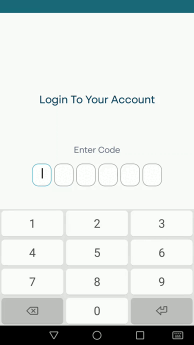

# Adesoji Olowa

### I am Adesoji Olowa, a dedicated Android developer focused on crafting high-performing applications using the best practices. Eager to learn new technologies, I bring innovative solutions to projects, meeting tight deadlines and embracing challenges with enthusiasm. Let's connect and take your organization to new heights with my passion for creating exceptional Android experiences.

&nbsp;&nbsp;&nbsp;&nbsp;&nbsp;&nbsp;

# YouHr - Youverify Employee Management tool

This is an HR App developed as an internal tool for [Youverify](https://youverify.co/) to efficiently manage and organize employee-related tasks and information. It provides a user-friendly interface and essential features for handling various HR processes seamlessly. The app constantly communicates with a remote server to fetch employee data (documents, leave history, profile). To ensure a great user experience, it employs an offline-first approach, caching critical data on the device's local storage using the Room Library. The Jetpack Paging 3 library is also used to achieve efficient memory usage.
It has typical Hr features like:
### Features
1. **Authentication:**
   - Employees can log in securely using their passwords and passcodes to access the app. They can also reset their password.

2. **Leave Management:**
   - Employees can request leaves, and HR administrators can review, approve, or reject them through the app.
   - The app also allows employees to check their leave balances and history.

3. **Task Management:**
   - HR administrators can assign tasks to employees, set deadlines, and track their progress through the app.
   - Employees can view their assigned tasks, mark them as completed, and add comments if needed.

4. **Document Upload:**
   - The app enables employees to upload and store important documents securely.
   - HR administrators can manage and organize employee documents efficiently.

5. **Profile Management:**
   - Employees can update and maintain their personal and professional information in their profiles.
   - HR administrators can access and manage employee profiles, ensuring accurate records.

### Technologies Used
- **Jetpack Compose**
- **Room Library**
- **Retrofit**
- **Dagger Hilt**
- **Jetpack Paging 3 Library**
- **Clean Architecture with MVVM**

# Yvos Android Sdk

An android Library that enables clients to integrate Youverify's services into their Android app with minimal effort. It is heavily reliant on the "Builder" creational pattern to create Objects and communicates with a remote server to load the appropriate service. 
It includes the following identity verification services:

- Identity verification forms that can be filled out by users
- Liveness check functionality
- Document capture functionality

 

### Technologies Used
- **Jetpack Compose, XML**
- **Kotlin**
- **Retrofit**
- **Dokka (Documentation)**
- **MVVM**

## Thanks for stopping by!
  

   LICENCE
-----

 Copyright 2022 Adesoji Olowa

    Licensed under the Apache License, Version 2.0 (the "License");
    you may not use this file except in compliance with the License.
    You may obtain a copy of the License at

        http://www.apache.org/licenses/LICENSE-2.0

    Unless required by applicable law or agreed to in writing, software
    distributed under the License is distributed on an "AS IS" BASIS,
    WITHOUT WARRANTIES OR CONDITIONS OF ANY KIND, either express or implied.
    See the License for the specific language governing permissions and
    limitations under the License.
